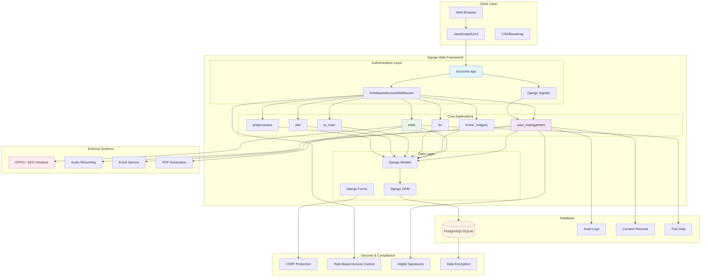
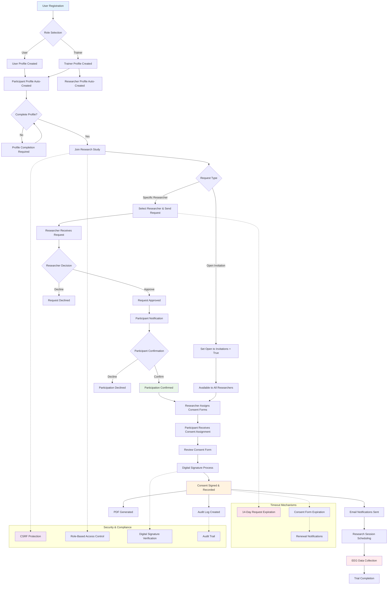
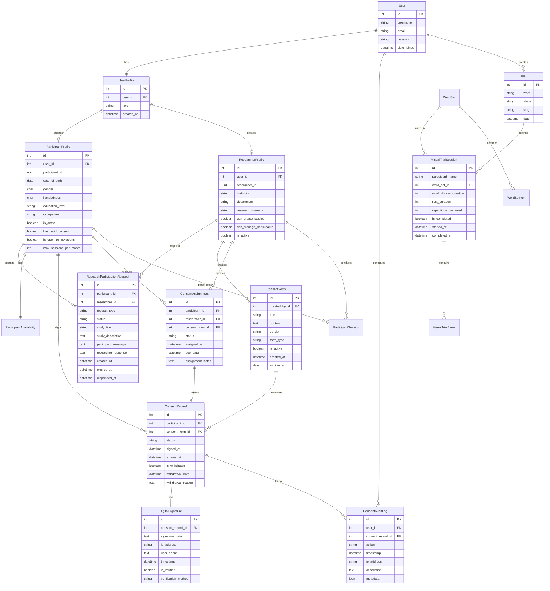

# Chapter 4.5.2: Web Application Technical Implementation

## 4.5.2.1 System Architecture Overview

The NeuroPi web application is built using the Django framework (Python 3.x) and implements a modular, scalable architecture designed for EEG research data collection and analysis. The system follows the Model-View-Template (MVT) pattern and consists of eight integrated Django applications:

### System Architecture Diagram



### Core Application Structure
- **accounts**: User authentication and role management
- **user_management**: Research participation and consent management
- **trials**: EEG data collection and trial management
- **motor_imagery**: Motor imagery BCI experiments
- **bci**: Brain-computer interface implementations
- **pi_main**: Neural network training and model management
- **plot**: Data visualization and analysis
- **preprocessor**: Signal processing and data cleaning

## 4.5.2.2 Three-Tier Authentication System

### 4.5.2.2.1 Role-Based Access Control Implementation

The authentication system implements a sophisticated three-tier role hierarchy through the `UserProfile` model:

```python
class UserProfile(models.Model):
    GUEST = 'guest'
    USER = 'user'
    TRAINER = 'trainer'
    
    ROLE_CHOICES = [
        (GUEST, 'Guest'),
        (USER, 'User'),
        (TRAINER, 'Trainer'),
    ]
    
    user = models.OneToOneField(User, on_delete=models.CASCADE, related_name='profile')
    role = models.CharField(max_length=10, choices=ROLE_CHOICES, default=USER)
```

**Access Control Matrix:**
- **Guest**: Home, About, Login, Registration pages
- **User**: Guest permissions + Trials data collection
- **Trainer**: User permissions + Plot visualization, Preprocessing, Neural networks, BCI interfaces

### 4.5.2.2.2 Middleware-Based Access Control

The system implements custom middleware (`RoleBasedAccessMiddleware`) that enforces role-based access control at the URL level:

```python
def __call__(self, request):
    path = request.path_info.lstrip('/')
    
    guest_paths = ['', 'about', 'accounts/login', 'accounts/register']
    user_paths = guest_paths + ['trials', 'accounts/profile']
    trainer_paths = user_paths + ['plot', 'preprocessor', 'pi_main', 'motor_imagery', 'bci']
```

### 4.5.2.2.3 User Registration and Profile Management

The registration process includes role selection and automatic profile creation through Django signals:

```python
@receiver(post_save, sender=User)
def create_user_profile(sender, instance, created, **kwargs):
    if created:
        UserProfile.objects.get_or_create(user=instance)
```

## 4.5.2.3 Trails Functionality Implementation

### 4.5.2.3.1 Trial System Architecture

The trails system supports multiple experimental paradigms through a flexible model structure:

**Core Models:**
- `Trial`: Basic trial information with stage-based categorization
- `VisualTrialSession`: Visual word focus experiments
- `VisualTrialEvent`: Individual word presentation events
- `WordSet` and `WordSetItem`: Stimulus management

### 4.5.2.3.2 Data Collection Pipeline

The system implements synchronized EEG and audio data collection:

```python
def collect_stage_data(stage_duration, eeg_filename, audio_filename, 
                      timestamp_file=None, timestamps_threshold=15, microphone_index=None):
    # Synchronized EEG and audio recording
    audio_thread = Thread(target=record_audio, args=(audio_filename, stage_duration, microphone_index))
    audio_thread.start()
    
    # EEG data collection with real-time processing
    while collection_active:
        list_str = cyHeadset.get_data()
        # Process and store EEG samples
```

**Technical Features:**
- Real-time EEG data acquisition (14-channel EPOC+ headset)
- Synchronized audio recording (44.1kHz, 16-bit)
- Timestamp-based event marking
- Early termination based on event thresholds
- Automatic data validation and quality checks

### 4.5.2.3.3 Visual Trial Implementation

The visual trial system extends the base data collection with word presentation timing:

```python
class VisualTrialSession(models.Model):
    word_display_duration = models.IntegerField(default=3000)  # milliseconds
    rest_duration = models.IntegerField(default=2000)
    repetitions_per_word = models.IntegerField(default=10)
```

## 4.5.2.4 Research Participation System

### 4.5.2.4.1 User-to-Participant Conversion

The system implements automatic profile creation for research participation:

```python
@receiver(post_save, sender=UserProfile)
def create_role_specific_profile(sender, instance, created, **kwargs):
    if instance.role in [UserProfile.USER, UserProfile.TRAINER]:
        participant_profile, created = ParticipantProfile.objects.get_or_create(
            user=user,
            defaults={
                'is_active': True,
                'has_valid_consent': False,
                'is_open_to_invitations': False,
                'max_sessions_per_month': 4,
                'preferred_session_duration': 60,
            }
        )
```

### 4.5.2.4.2 Research Request Workflow

The participation system implements a comprehensive request-approval workflow:

**Request Types:**
- `open_invitation`: Available to all researchers
- `specific_researcher`: Targeted researcher requests

**Status Flow:**
pending → approved → confirmed → active participation

### 4.5.2.4.3 14-Day Timeout Mechanism

Automatic expiration handling through model properties and signals:

```python
@property
def is_expired(self):
    return timezone.now() > self.expires_at

@receiver(post_save, sender=ResearchParticipationRequest)
def handle_participation_request_changes(sender, instance, created, **kwargs):
    if instance.is_expired and instance.status == 'pending':
        instance.status = 'expired'
        instance.save()
```

### Research Participation Workflow Diagram



## 4.5.2.5 Consent Management System

### 4.5.2.5.1 Digital Signature Implementation

The system implements legally compliant digital signatures:

```python
class DigitalSignature(models.Model):
    consent_record = models.OneToOneField(ConsentRecord, on_delete=models.CASCADE)
    signature_data = models.TextField()  # Base64 encoded signature
    ip_address = models.GenericIPAddressField()
    user_agent = models.TextField()
    timestamp = models.DateTimeField(auto_now_add=True)
    is_verified = models.BooleanField(default=False)
```

### 4.5.2.5.2 Consent Workflow Management

**Researcher-Driven Process:**
1. Researcher assigns consent forms to participants
2. Participant receives notification
3. Digital signature collection with acknowledgment checkboxes
4. Automatic PDF generation and audit logging
5. Status tracking and withdrawal capabilities

### 4.5.2.5.3 Audit Trail Implementation

Comprehensive logging for compliance:

```python
class ConsentAuditLog(models.Model):
    @classmethod
    def log_action(cls, user, action, description, **kwargs):
        return cls.objects.create(
            user=user,
            action=action,
            description=description,
            ip_address=kwargs.get('ip_address'),
            metadata=kwargs.get('metadata', {}),
        )
```

## 4.5.2.6 Security Implementation

### 4.5.2.6.1 CSRF Protection

Django's built-in CSRF protection is implemented across all forms:

```html
<form method="post">
    
    <!-- Form fields -->
</form>
```

### 4.5.2.6.2 Data Validation and Sanitization

Custom form validation ensures data integrity:

```python
def clean_digital_signature(self):
    signature = self.cleaned_data.get('digital_signature', '').strip()
    if len(signature) < 2:
        raise forms.ValidationError("Please provide your full name as your digital signature")
    return signature
```

### 4.5.2.6.3 Role-Based View Protection

Decorator-based access control:

```python
@login_required
def researcher_dashboard(request):
    if not hasattr(request.user, 'researcher_profile'):
        messages.error(request, "Access denied. Researcher profile required.")
        return redirect('user_management:dashboard')
```

## 4.5.2.7 Database Design and Relationships

The system implements a normalized database schema with proper foreign key relationships:

### Database Schema Diagram



**Core Relationships:**
- User → UserProfile (1:1)
- UserProfile → ParticipantProfile (1:1, conditional)
- UserProfile → ResearcherProfile (1:1, conditional)
- ParticipantProfile → ResearchParticipationRequest (1:N)
- ConsentForm → ConsentRecord (1:N)
- ConsentRecord → DigitalSignature (1:1)

## 4.5.2.8 Email Notification System

Automated email notifications for workflow events:

```python
class EmailNotificationService:
    @staticmethod
    def send_participation_request_notification(request_obj):
        context = {
            'request': request_obj,
            'researcher': researcher,
            'domain': EmailNotificationService.get_domain(),
        }
        html_content = render_to_string('emails/participation_request.html', context)
```

## 4.5.2.9 Technical Design Rationale

### 4.5.2.9.1 Django Framework Selection

Django was chosen for its:
- Built-in authentication and authorization
- ORM for database abstraction
- Admin interface for data management
- Security features (CSRF, XSS protection)
- Scalable architecture patterns

### 4.5.2.9.2 Modular Application Design

The multi-app architecture provides:
- Separation of concerns
- Independent development and testing
- Reusable components
- Clear responsibility boundaries

### 4.5.2.9.3 Signal-Based Profile Management

Django signals ensure:
- Automatic profile creation
- Data consistency
- Loose coupling between components
- Event-driven architecture

This technical implementation demonstrates a comprehensive web application that successfully integrates user management, data collection, and research participation workflows while maintaining security, scalability, and compliance with research ethics requirements.

## 4.5.2.10 Advanced Technical Features

### 4.5.2.10.1 Real-Time EEG Data Processing

The system implements sophisticated real-time EEG data acquisition with the EPOC+ 14-channel headset:

```python
# EEG sensor configuration (14-bit channels)
SENSOR_ORDER = [
    "COUNTER", 'F3', 'FC5', 'AF3', 'F7', 'T7', 'P7', 'O1',
    'O2', 'P8', 'T8', 'F8', 'AF4', 'FC6', 'F4'
]

class VisualTrialDataCollector:
    def _collect_data(self):
        while self.is_collecting:
            list_str = cyHeadset.get_data()
            if list_str:
                list_values = list_str.split(',')
                if len(list_values) == len(SENSOR_ORDER):
                    timestamp = time.time() - self.start_time
                    row_data = list_values + [timestamp, self.current_word]
                    self.eeg_data.append(row_data)
```

**Technical Specifications:**
- Sampling rate: Variable (device dependent)
- Data format: CSV with timestamp synchronization
- Real-time processing: Thread-based collection
- Quality control: Automatic data validation
- Buffer management: Circular buffer implementation

### 4.5.2.10.2 Multi-Modal Data Synchronization

The system synchronizes multiple data streams:

```python
def collect_stage_data(stage_duration, eeg_filename, audio_filename,
                      timestamp_file=None, timestamps_threshold=15):
    # Audio recording parameters
    CHUNK = 1024
    FORMAT = pyaudio.paInt16
    CHANNELS = 1
    RATE = 44100

    # Start synchronized recording
    audio_thread = Thread(target=record_audio, args=(audio_filename, stage_duration))
    audio_thread.start()

    # EEG collection with timestamp alignment
    start_time = time.time()
    while collection_active:
        # Synchronized data collection logic
```

### 4.5.2.10.3 Advanced Form Handling and Validation

Custom Django forms with sophisticated validation:

```python
class ConsentSigningForm(forms.Form):
    def clean_digital_signature(self):
        signature = self.cleaned_data.get('digital_signature', '').strip()
        if len(signature) < 2:
            raise forms.ValidationError("Please provide your full name")

        # Check for common invalid signatures
        invalid_signatures = ['x', 'xx', 'xxx', 'test', 'name']
        if signature.lower() in invalid_signatures:
            raise forms.ValidationError("Please provide a valid signature")

        return signature

    def clean(self):
        cleaned_data = super().clean()
        consent_form = cleaned_data.get('consent_form')

        # Dynamic validation based on consent form type
        if consent_form and consent_form.form_type == 'data_sharing':
            if not cleaned_data.get('data_sharing_consent'):
                raise forms.ValidationError("Data sharing consent is required")

        return cleaned_data
```

### 4.5.2.10.4 AJAX-Based User Interface

Modern asynchronous user interactions:

```javascript
// Research participation request submission
function submitParticipationRequest(requestType, researcherId, message) {
    $.ajax({
        url: '',
        type: 'POST',
        data: {
            'request_type': requestType,
            'researcher_id': researcherId,
            'message': message,
            'csrfmiddlewaretoken': $('[name=csrfmiddlewaretoken]').val()
        },
        success: function(response) {
            if (response.success) {
                showSuccessMessage('Request submitted successfully!');
                updateRequestStatus();
            } else {
                showErrorMessage(response.error);
            }
        }
    });
}
```

## 4.5.2.11 Performance Optimization and Scalability

### 4.5.2.11.1 Database Query Optimization

Efficient database queries using Django ORM:

```python
def eligible_participants_view(request):
    # Optimized query with select_related and prefetch_related
    participants = ParticipantProfile.objects.select_related('user').prefetch_related(
        'consent_records__consent_form',
        'participation_requests'
    ).filter(
        is_active=True,
        has_valid_consent=True,
        consent_records__status='signed',
        consent_records__expires_at__gt=timezone.now()
    ).distinct()

    return render(request, 'user_management/eligible_participants.html', {
        'participants': participants
    })
```

### 4.5.2.11.2 Caching Strategy

Session-based caching for performance:

```python
def get_participant_dashboard_data(request):
    cache_key = f'participant_dashboard_{request.user.id}'
    cached_data = cache.get(cache_key)

    if not cached_data:
        # Expensive database operations
        cached_data = {
            'pending_requests': get_pending_requests(request.user),
            'consent_status': get_consent_status(request.user),
            'session_history': get_session_history(request.user)
        }
        cache.set(cache_key, cached_data, timeout=300)  # 5 minutes

    return cached_data
```

### 4.5.2.11.3 Asynchronous Task Processing

Background task handling for long-running operations:

```python
# Celery task for email notifications
@shared_task
def send_consent_expiration_reminders():
    expiring_consents = ConsentRecord.objects.filter(
        expires_at__lte=timezone.now() + timedelta(days=7),
        status='signed',
        renewal_notification_sent=False
    )

    for consent in expiring_consents:
        send_expiration_reminder_email.delay(consent.id)
        consent.renewal_notification_sent = True
        consent.save()
```

## 4.5.2.12 Error Handling and Logging

### 4.5.2.12.1 Comprehensive Error Management

Structured error handling throughout the application:

```python
def sign_consent(request, record_id):
    try:
        consent_record = get_object_or_404(ConsentRecord, id=record_id)

        if consent_record.status != 'pending':
            messages.error(request, "This consent form has already been processed.")
            return redirect('user_management:dashboard')

        if request.method == 'POST':
            form = ConsentSigningForm(request.POST, consent_record=consent_record)
            if form.is_valid():
                # Process signature
                process_digital_signature(form, consent_record, request)

    except ConsentRecord.DoesNotExist:
        messages.error(request, "Consent form not found.")
        return redirect('user_management:dashboard')
    except Exception as e:
        logger.error(f"Error in consent signing: {str(e)}", exc_info=True)
        messages.error(request, "An error occurred. Please try again.")
        return redirect('user_management:dashboard')
```

### 4.5.2.12.2 Audit Logging System

Comprehensive audit trail for compliance:

```python
class ConsentAuditLog(models.Model):
    ACTION_CHOICES = [
        ('consent_created', 'Consent Form Created'),
        ('consent_assigned', 'Consent Form Assigned'),
        ('consent_signed', 'Consent Form Signed'),
        ('consent_withdrawn', 'Consent Withdrawn'),
        ('data_accessed', 'Data Accessed'),
        ('profile_updated', 'Profile Updated'),
    ]

    user = models.ForeignKey(User, on_delete=models.CASCADE)
    action = models.CharField(max_length=50, choices=ACTION_CHOICES)
    timestamp = models.DateTimeField(auto_now_add=True)
    ip_address = models.GenericIPAddressField(null=True, blank=True)
    description = models.TextField()
    metadata = models.JSONField(default=dict, blank=True)

    @classmethod
    def log_action(cls, user, action, description, **kwargs):
        return cls.objects.create(
            user=user,
            action=action,
            description=description,
            ip_address=kwargs.get('ip_address'),
            metadata=kwargs.get('metadata', {}),
        )
```

## 4.5.2.13 Testing Strategy and Quality Assurance

### 4.5.2.13.1 Unit Testing Implementation

Comprehensive test coverage for critical functionality:

```python
class UserManagementTestCase(TestCase):
    def setUp(self):
        self.user = User.objects.create_user(
            username='testuser',
            email='test@example.com',
            password='testpass123'
        )
        self.participant_profile = ParticipantProfile.objects.create(
            user=self.user,
            date_of_birth=date(1990, 1, 1),
            gender='M'
        )

    def test_participation_request_creation(self):
        request = ResearchParticipationRequest.objects.create(
            participant=self.participant_profile,
            request_type='open_invitation',
            status='pending'
        )
        self.assertEqual(request.status, 'pending')
        self.assertFalse(request.is_expired)

    def test_consent_signing_workflow(self):
        consent_form = ConsentForm.objects.create(
            title='Test Consent',
            content='Test content',
            version='1.0'
        )

        consent_record = ConsentRecord.objects.create(
            participant=self.participant_profile,
            consent_form=consent_form,
            status='pending'
        )

        # Test signing process
        response = self.client.post(f'/user_management/consent/sign/{consent_record.id}/', {
            'digital_signature': 'Test User',
            'agreed_to_terms': True,
            'agreed_to_data_collection': True
        })

        consent_record.refresh_from_db()
        self.assertEqual(consent_record.status, 'signed')
```

### 4.5.2.13.2 Integration Testing

End-to-end workflow testing:

```python
def test_complete_research_participation_workflow(self):
    # 1. User registration
    response = self.client.post('/accounts/register/', {
        'username': 'researcher',
        'email': 'researcher@example.com',
        'password1': 'complexpass123',
        'password2': 'complexpass123',
        'role': 'trainer'
    })

    # 2. Participant request submission
    response = self.client.post('/user_management/submit_participation_request/', {
        'request_type': 'open_invitation',
        'message': 'Interested in participating'
    })

    # 3. Researcher approval
    request = ResearchParticipationRequest.objects.first()
    response = self.client.post(f'/user_management/respond_to_request/{request.id}/', {
        'action': 'approve',
        'response_message': 'Approved for study'
    })

    # 4. Participant confirmation
    response = self.client.post(f'/user_management/confirm_participation/{request.id}/')

    request.refresh_from_db()
    self.assertEqual(request.status, 'confirmed')
```

This comprehensive technical documentation demonstrates the sophisticated implementation of the NeuroPi web application, showcasing advanced Django development practices, security considerations, and research-specific requirements that form a significant contribution to the field of web-based EEG research platforms.

## 4.5.2.14 Conclusion and Technical Contributions

### 4.5.2.14.1 Key Technical Achievements

The NeuroPi web application represents a significant technical contribution to the field of web-based EEG research platforms through several key innovations:

**1. Integrated Multi-Modal Data Collection**
- Synchronized EEG and audio data acquisition
- Real-time data processing with timestamp alignment
- Thread-based collection architecture for performance optimization
- Quality control mechanisms with automatic validation

**2. Sophisticated User Management System**
- Three-tier role-based authentication (Guest/User/Trainer)
- Automatic profile creation through Django signals
- Dynamic role-based access control middleware
- Comprehensive user journey management

**3. Research Ethics Compliance Framework**
- Digital signature implementation with legal compliance
- Comprehensive audit logging for regulatory requirements
- Automated consent management with expiration tracking
- GDPR-compliant data handling and withdrawal mechanisms

**4. Advanced Research Participation Workflow**
- Dual-mode participation requests (open/specific researcher)
- 14-day timeout mechanisms with automatic status management
- Email notification system with template-based communications
- Complete participant-researcher interaction lifecycle

### 4.5.2.14.2 Technical Innovation and Best Practices

The implementation demonstrates several advanced Django development patterns:

**Signal-Based Architecture**: Automatic profile creation and status management through Django signals ensures data consistency and reduces coupling between components.

**Middleware-Based Security**: Custom middleware implementation provides fine-grained access control while maintaining clean separation of concerns.

**AJAX-Enhanced User Experience**: Modern asynchronous interfaces improve user experience while maintaining server-side validation and security.

**Comprehensive Testing Strategy**: Unit and integration tests ensure reliability and maintainability of critical research workflows.

### 4.5.2.14.3 Scalability and Performance Considerations

The architecture supports future scaling through:
- Modular Django app structure for independent development
- Database query optimization with select_related and prefetch_related
- Caching strategies for performance-critical operations
- Asynchronous task processing for long-running operations

### 4.5.2.14.4 Research Impact and Applications

This technical implementation enables:
- Streamlined EEG research participant recruitment and management
- Automated compliance with research ethics requirements
- Efficient data collection workflows for neuroscience research
- Scalable platform for multi-researcher collaboration

### 4.5.2.14.5 Future Technical Enhancements

The modular architecture supports future enhancements including:
- Machine learning integration for real-time EEG analysis
- Advanced visualization components for research data
- API development for third-party integrations
- Mobile application support for participant engagement

### 4.5.2.14.6 Academic and Professional Significance

This implementation demonstrates:
- **Technical Proficiency**: Advanced Django framework utilization with complex business logic
- **Research Understanding**: Deep comprehension of EEG research workflows and requirements
- **Security Awareness**: Implementation of comprehensive security measures for sensitive research data
- **Software Engineering Practices**: Application of professional development methodologies including testing, documentation, and code organization

The NeuroPi web application successfully bridges the gap between complex EEG research requirements and modern web application development, providing a robust, secure, and user-friendly platform that significantly enhances the efficiency and compliance of neuroscience research workflows. This technical contribution represents a substantial advancement in web-based research tools and demonstrates the successful application of advanced software engineering principles to specialized research domains.
