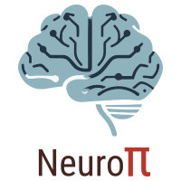

# NeuroPi - EEG Speech Detection Platform

<div align="center">
  
  <h3>A comprehensive platform for EEG data collection, processing, and neural network analysis</h3>
</div>

## Overview

NeuroPi is an integrated Django-based platform designed for EEG research, focusing on speech and motor activity patterns in the brain. It provides a complete workflow from data collection to analysis, with specialized tools for studying the neural correlates of speech and motor activity.

By combining EEG recordings with synchronized audio capture and timestamping capabilities, NeuroPi allows for precise alignment of brain activity with speech or motor events, opening new avenues for research in neurolinguistics, brain-computer interfaces, and cognitive neuroscience.

## Key Features

- **Structured Trial Design**: Organize experiments into trials, words, and stages for consistent data collection protocols
- **Synchronized Audio Capture**: Record audio in perfect synchronization with EEG data for speech analysis
- **Advanced Signal Processing**: Apply filters, ICA, and other techniques to clean and enhance EEG signals
- **Interactive Visualization**: Visualize EEG data with customizable plots and comparisons between channels and stages
- **Event Timestamping**: Mark specific events during trials for precise correlation with EEG data
- **Dataset Generation**: Create machine learning-ready datasets with train-test splitting and appropriate stratification
- **Neural Network Training**: Train RNN models on processed EEG data to recognize speech patterns
- **Live Prediction**: Use trained models for real-time EEG speech recognition

## Installation

### Prerequisites

- Python 3.8+ (3.9 recommended)
- [Emotiv EPOC+](https://www.emotiv.com/epoc/) EEG headset (for data collection)
- Windows/Linux/macOS operating system

### Basic Installation (CPU)

1. Clone the repository:
   ```bash
   git clone https://github.com/yourusername/NeuroPi.git
   cd NeuroPi
   ```

2. Create a virtual environment:
   ```bash
   # Using conda (recommended)
   conda create -n neuropi python=3.9
   conda activate neuropi
   
   # Or using venv
   python -m venv venv
   # On Windows
   venv\Scripts\activate
   # On Linux/macOS
   source venv/bin/activate
   ```

3. Install the required packages:
   ```bash
   pip install -r requirements.txt
   ```

4. Initialize the database:
   ```bash
   python manage.py makemigrations
   python manage.py makemigrations trials
   python manage.py makemigrations processor
   python manage.py makemigrations cleaner
   python manage.py makemigrations plot
   python manage.py makemigrations pi_main
   python manage.py migrate
   ```

5. Run the development server:
   ```bash
   python manage.py runserver
   ```

6. Access the application at http://127.0.0.1:8000/

### GPU Installation (for faster neural network training)

If you want to utilize GPU acceleration for neural network training, follow these additional steps:

1. Make sure you have a compatible NVIDIA GPU and have installed the appropriate NVIDIA drivers

2. Install the GPU-specific dependencies:
   ```bash
   pip install -r requirements-gpu.txt
   ```

Note: The GPU installation requires an NVIDIA GPU with CUDA support. TensorFlow will automatically detect and use your GPU if it's properly set up.

## Project Structure

NeuroPi consists of several integrated apps:

- **trials**: Manages the collection of EEG and audio data during trial sessions
- **processor**: Processes raw EEG data and identifies speech/motor events
- **cleaner**: Applies filters and artifact removal to enhance EEG signal quality
- **plot**: Visualizes EEG data with interactive plots and comparisons
- **pi_main**: Trains and manages neural network models for EEG pattern recognition

## Usage Guide

### Data Collection

1. Start a new trial by selecting a participant and word
2. Proceed through the 5 different trial stages:
   - Stage 1: Vocal (saying the word out loud)
   - Stage 2: Non-Vocal (thinking about saying the word)
   - Stage 3: Motor (performing the action without speaking)
   - Stage 4: Motor + Vocal (performing the action while saying the word)
   - Stage 5: Motor + Non-Vocal (performing the action while thinking about the word)
3. For each stage, record EEG data and add timestamps as needed

### Data Processing

1. Use the Processor to process raw EEG data and detect speech events
2. Apply appropriate settings based on your research needs
3. Generate combined datasets for further analysis or training

### Signal Cleaning

1. Use the Cleaner to apply filters and remove artifacts from your EEG data
2. Select filter types and parameters appropriate for speech detection
3. Generate cleaned datasets ready for visualization or model training

### Visualization

1. Select a participant and dataset to visualize
2. Choose specific words, stages, and EEG channels to display
3. Use the interactive controls to explore the data

### Neural Network Training

1. Select a processed dataset for training
2. Configure model parameters (epochs, batch size, etc.)
3. Start training and monitor progress
4. Evaluate model performance

### Live Prediction

1. Select a trained model
2. Configure prediction settings
3. Record live EEG data and get real-time predictions

## Research Applications

- **Neurolinguistics**: Study neural patterns during speech production and comprehension
- **Brain-Computer Interfaces**: Develop systems for controlling devices using speech or motor imagery
- **Cognitive Neuroscience**: Investigate cognitive processes underlying speech and motor planning
- **Speech Pathology**: Research neural correlates of speech disorders and potential interventions
- **Machine Learning**: Create datasets for training models to recognize speech patterns from EEG

## Hardware Compatibility

NeuroPi is designed to work with the Emotiv EPOC+ EEG headset, which provides 14 channels of EEG data at a sampling rate of 128 Hz. The key hardware features include:

- 14 channel EEG recording
- 128 Hz sampling rate
- Wireless data transmission
- Built-in battery for portable operation

## Contributing

Contributions to NeuroPi are welcome! Please feel free to submit a Pull Request.

## License

This project is licensed under the MIT License - see the LICENSE file for details.

## Acknowledgments

Special thanks to all the researchers and developers who have contributed to the fields of EEG analysis, speech recognition, and brain-computer interfaces, whose work has made this project possible.